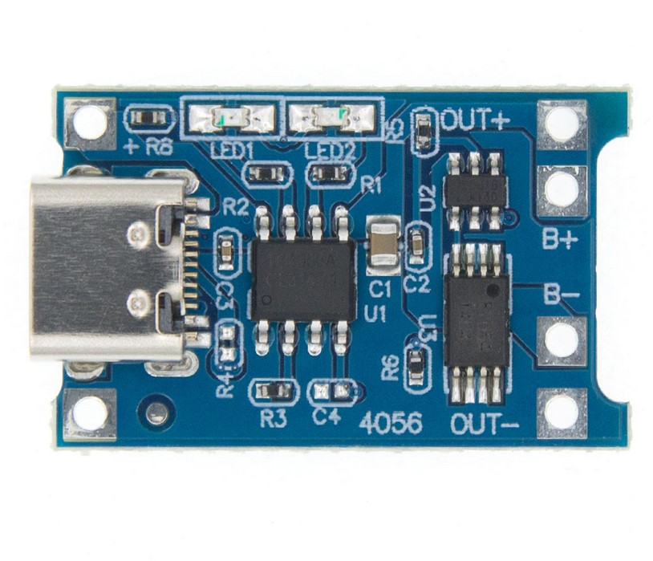

# JoyStick for drone by Arduino(PlatformIO)

Вітаємо! У данному репозиторії знаходиться схема збирання пульта для FPV дрона. Базового з майбутніми модифікаціями для більшої ефективності та функціональності.

Программа для роботи схеми майже універсальна. Тому коли будете писати під інші плати та МКР незабудьте відредагувати Макро визначення у файлі `/src/config.hpp`

## Базова збірка

* Мікроконтролер та плата -> AtMega328PU Arduino Nano 3.0
* Звичайна тактова кнопка -> 6шт.
* Звичайні аналогові джойстики PS2 -> 2шт.
* Джерело живлення -> Li-Pol 3.7V 2000mA*h
* Модуль контролю заряду та перерозряду -> TP4056 (версія із захистом від КЗ)
* DC-DC підвищувач з 3В до 5В -> MT3608

## Cхема(Fritzing)

---

Це повне схема джойстику.

## Джерело живлення

В базовому рішенні використовуються __Модуль для зарядки TP4056__ А також __Підвищуючий напругу перетворювач MT3608__. Оскільки основним джерелом виступає малий аккумулятор __Li-Pol 3.7V 2000mAh__

### TP4056

Це сами простий модуль для контролю заряду та перерозряду. Максимальна потужність йде 5Вт `5V та 1000mA`. Але навіть це можливо при модифікації компоненту на модулі з підписом R3 `SMD резистор`. За замовчуванням там стоїть `130mA`.

Згідно документації номінал резистору напряму залежить від струму:

| Номінал резистору (кОм)  | Вихідний струм(mA) |
| --- | --- |
| 10 | 130 |
| 5 | 250 |
| 4 | 300 |
| 3 | 400 |
| 2 | 580 |
| 1.66 | 690 |
| 1.5 | 780 |
| 1.33 | 900 |
| 1.2 | 1000 |

---